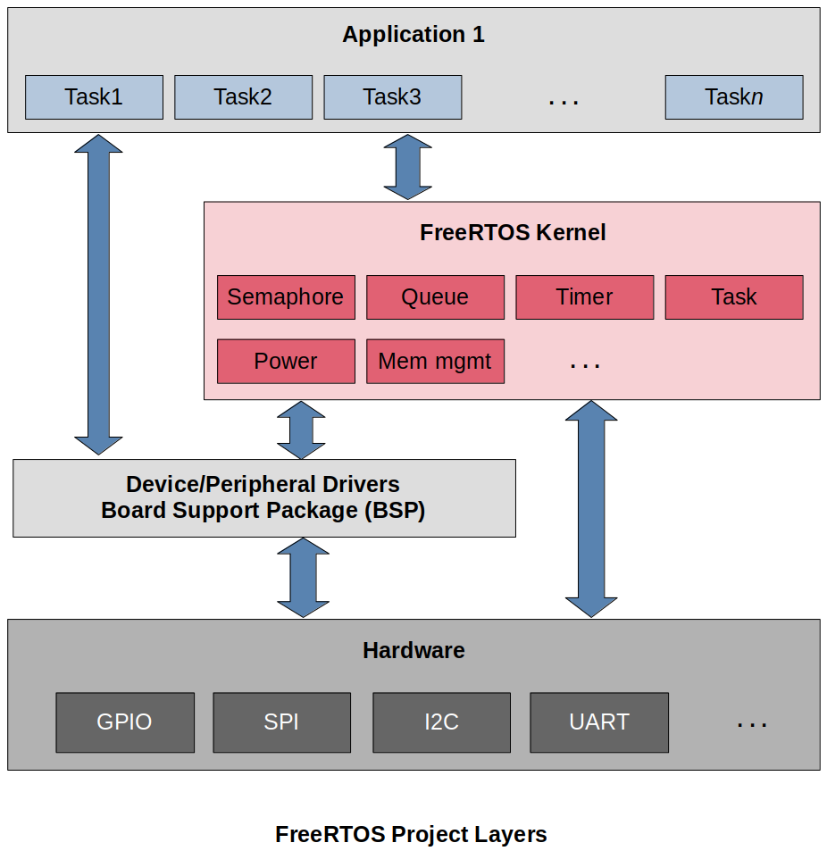
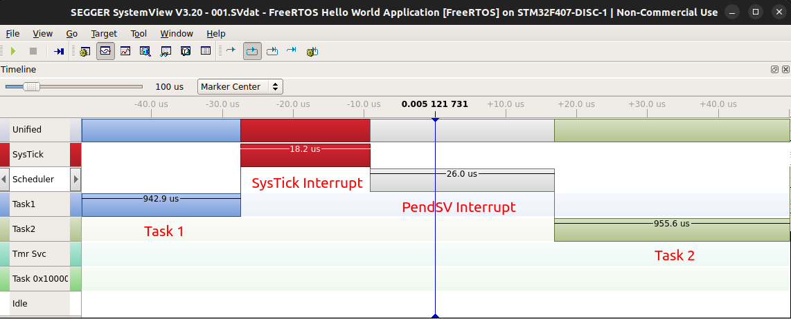

# FreeRTOS Projects

This repository contains the source code for the **FreeRTOS Projects**. Visit the "Real-Time Operating Systems (RTOS)" section on my website for more details: [https://jackklee.com/real-time-operating-systems/](https://jackklee.com/real-time-operating-systems/).

## Introduction

* A collection of projects designed to practice the FreeRTOS kernel integration, porting, and application development for STM32 target board
* Used STM32CubeIDE for software development, SEGGER SystemView software for realtime recording and program analysis

## FreeRTOS Project Layers

* The FreeRTOs kernel does NOT contain any code related to the hardware. You have to integrate the Device Driver (BSP) Layer to access the peripherals of the hardware. Device driver can be developed either by yourself or a third party. ([FreeRTOS Third Party Board Support Package (BSP)](https://www.freertos.org/FreeRTOS-Plus/BSP_Solutions/FreeRTOS_BSP.html))
* Application (user) tasks are usually implemented by using the APIs provided by the FreeRTOS kernel.

## SEGGER SystemView Realtime Recording

* SEGGER SystemView is used for realtime recording and program analysis. The following example shows the "context switching" moment captured from a FreeRTOS application.

